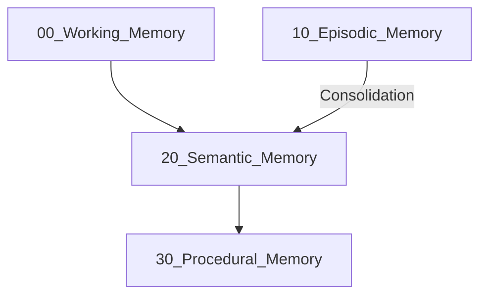

# Ontological Graph

```mermaid
graph TD
    WorkingMemory["00_Working_Memory"] --> SemanticMemory["20_Semantic_Memory"]
    EpisodicMemory["10_Episodic_Memory"] -->|Consolidation| SemanticMemory
    SemanticMemory --> ProceduralMemory["30_Procedural_Memory"]
```
